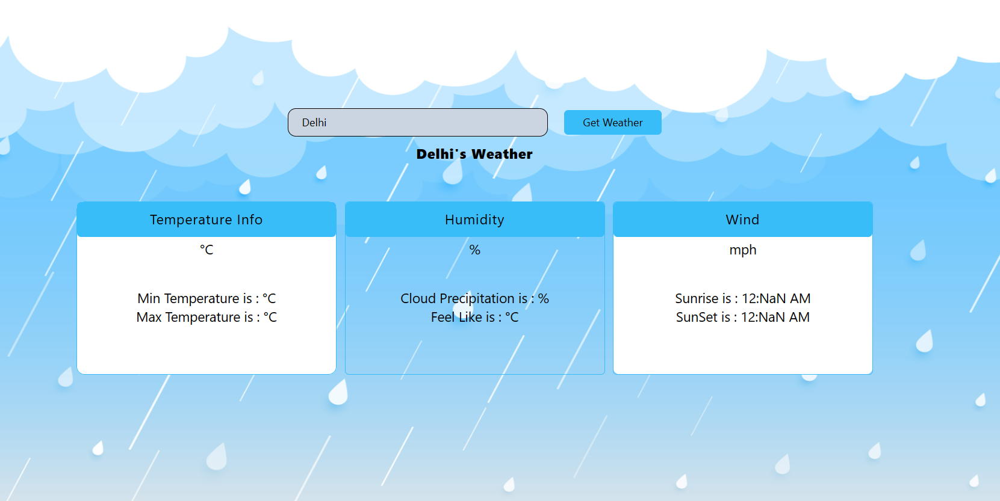

### Weather App Wireframe Document

#### Introduction

The wireframe document outlines the layout and structure of the Weather App's user interface. It includes wireframes for the main components, such as the input section, weather information display, loading indicators, and error messages.

#### Wireframes

##### 1. Landing Page

- **Input Section**: Displays an input field for entering the city name and a "Get Weather" button for initiating the weather data retrieval.
  

##### 2. Loading State

- **Loading Indicator**: Shows a loading indicator while the app fetches weather data.
 

#### 3. Error State
- **Error Message**: Displays an error message if there is an issue with the API request.

##### 4. Weather Information Display

- **Weather Information**: Presents weather information for the selected city, including temperature, humidity, and wind details.
 

##### 5``. Styling and UI Elements

- **UI Elements**: Wireframes include buttons, text inputs, and card components styled using Tailwind CSS.

